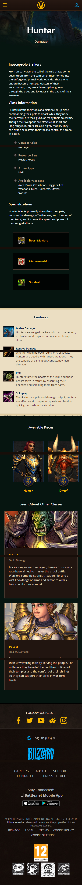
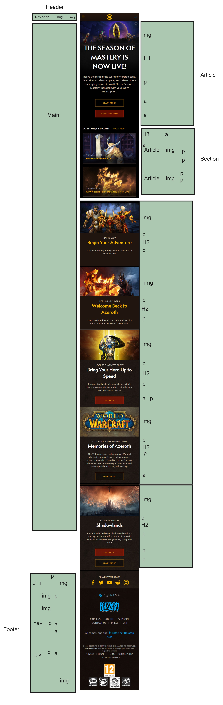
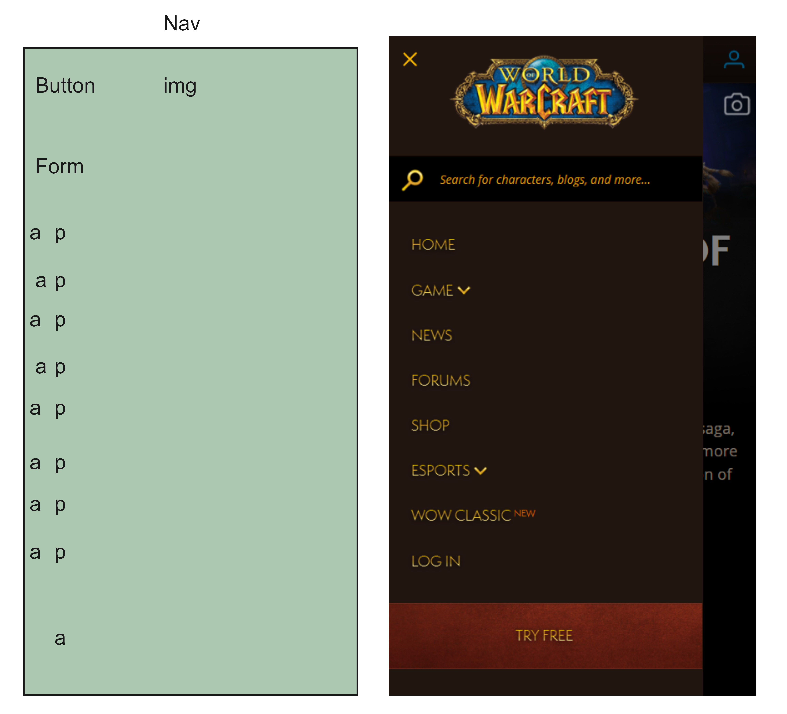
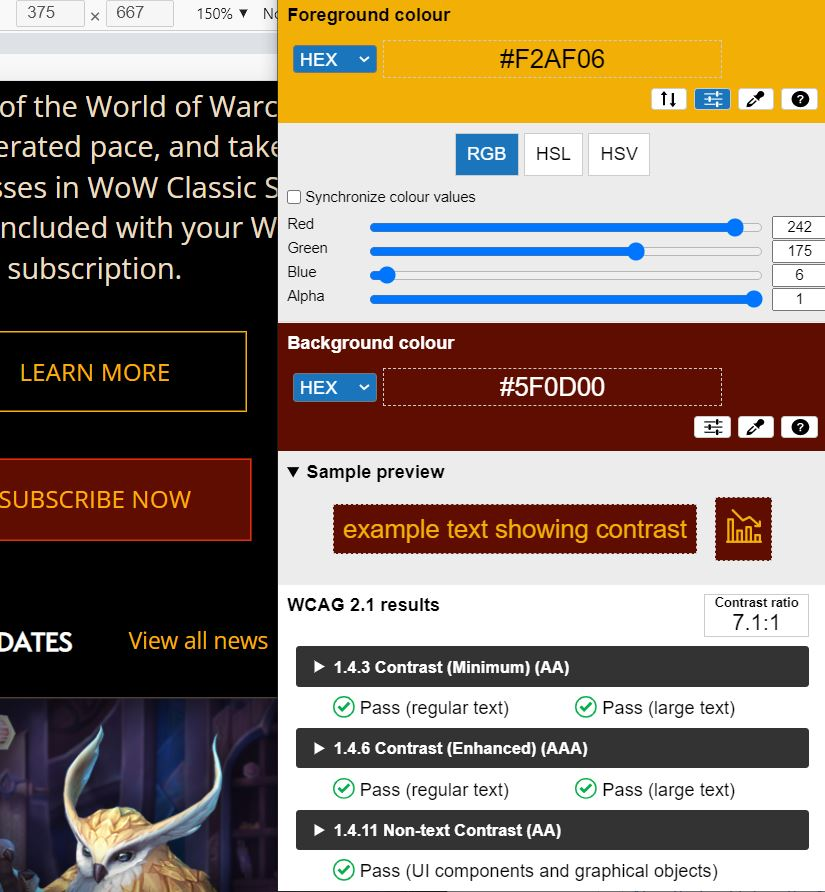
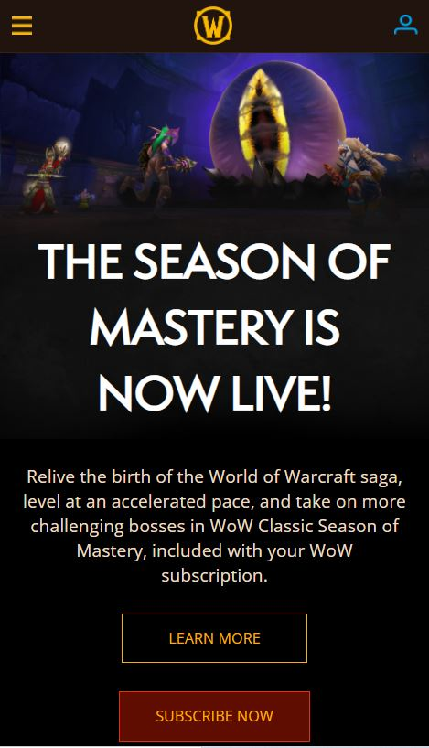
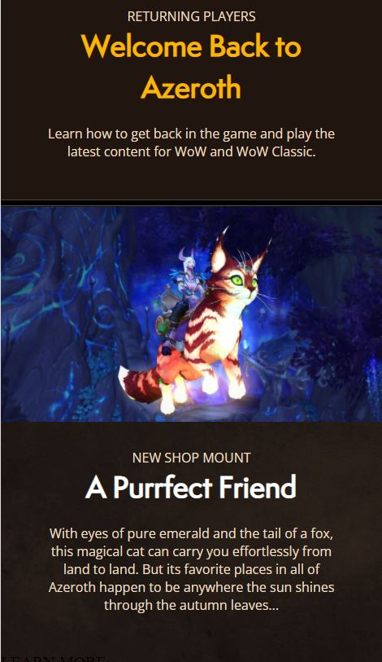
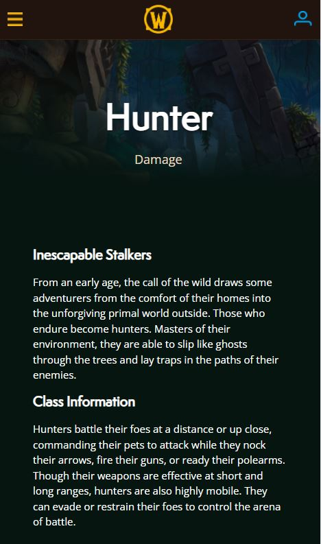
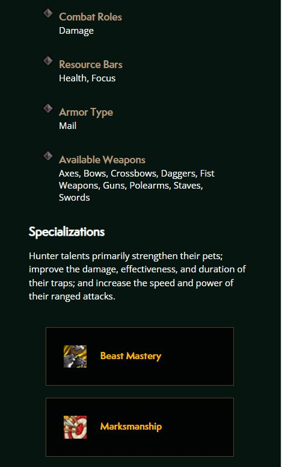
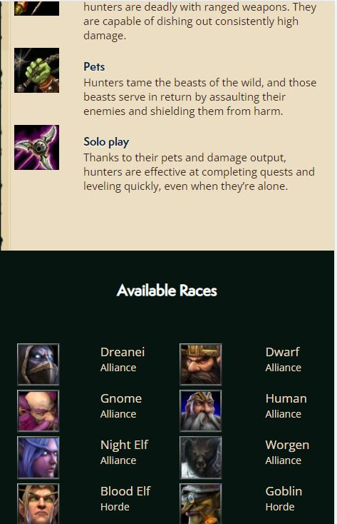
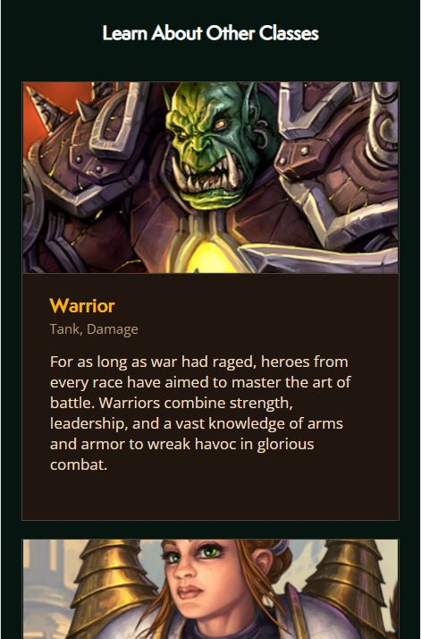

# Procesverslag
Markdown is een simpele manier om HTML te schrijven.  
Markdown cheat cheet: [Hulp bij het schrijven van Markdown](https://github.com/adam-p/markdown-here/wiki/Markdown-Cheatsheet).

Nb. De standaardstructuur en de spartaanse opmaak van de README.md zijn helemaal prima. Het gaat om de inhoud van je procesverslag. Besteedt de tijd voor pracht en praal aan je website.

Nb. Door *open* toe te voegen aan een *details* element kun je deze standaard open zetten. Fijn om dat steeds voor de relevante stuk(ken) te doen.

## Jij

uitwerken voor kick-off werkgroep

### Auteur:
Amber Mudde 

#### Je startniveau:
Blauwe piste

#### Je focus:
Surface plane
 

## Je website

uitwerken voor kick-off werkgroep

### Je opdracht:
https://worldofwarcraft.com/en-us/

#### Screenshot(s) van de eerste pagina (small screen): 
Homepage

#### Screenshot(s) van de tweede pagina (small screen):
Hunter class page

 

## Breakdownschets (week 1)

uitwerken na afloop 2e werkgroep

### de hele pagina: 

### dynamisch deel (bijv menu): 

## Voortgang 1 (week 2)

uitwerken voor 1e voortgang

### Stand van zaken
Ik begon heel goed met de html neerzetten. Dit ging allemaal vrij soepel doordat ik de breakpointschetsen had gemaakt. Ik vond het alleen wel wat 
lastiger om in te komen met de css. Hier liep ik dan bijvoorbeeld al vast met images de juiste grootte geven. De eerste image op mijn homepage 
stond bijvoorbeeld niet goed. Hij stond niet over de hele breedte van het scherm. Ook had ik veel moeite met de header. Ook hier werden de icoontjes
(images) op een of andere manier niet de juiste grootte. Ook was het weer even geleden dat ik flexbox had gebruikt, dus hier moest ik ook even mee spelen. 

### Agenda voor meeting
samen met je groepje opstellen

| student 1      | student 2          | student 3    | student 4        |
| ---            | ---                | ---          | ---              |
| dit bespreken  | en dit             | en ik dit    | en dan ik dat    |
| en dat ook nog | dit als er tijd is | nog een punt | dit wil ik zeker |
| ...            | ...                | ...          | ...              |

Ik wilde weten of ik goed op weg was. Ik had nog geen specifieke vragen over een bepaald element of onderdeel dat niet werkte, aangezien ik vooral nog html had. 

### Verslag van meeting
hier na afloop snel de uitkomsten van de meeting vastleggen

- Teveel ruimte aan de zijkanten kon ik oplossen door een standaard code toe te voegen aan de bovenkant van het css bestandje. 
- Ik hoef niet de volledige pagina van de site na te maken, maar ik kan ook delen gebruiken, omdat sommige blokken zich toch herhalen. 

## Voortgang 2 (week 3)

uitwerken voor 2e voortgang

### Stand van zaken
Het positioneren ging nu veel makkelijker en alles stond in principe op de goede plek (de delen die ik tot nu toe had uitgewerkt dan). 
Ook was ik heel tevereden met het feit dat het bovenste stuk van de website al bijna op een exacte kopie van de echte website begon te lijken. 
Ik heb veel geexperimenteerd met afstanden, sizes en borders om het zo goed mogelijk te laten lijken en dit heeft dus goed uitgepakt uiteindelijk. 

Er was eigenlijk 1 ding waar ik voornamelijk mee zat deze week en dat was een halfdoorzichtige gradient toepassen op een afbeelding. Dit heeft de 
site van World of Warcraft ook om daar de tekst beter leesbaar te maken. 

### Agenda voor meeting
samen met je groepje opstellen

| student 1      | student 2          | student 3    | student 4        |
| ---            | ---                | ---          | ---              |
| dit bespreken  | en dit             | en ik dit    | en dan ik dat    |
| en dat ook nog | dit als er tijd is | nog een punt | dit wil ik zeker |
| ...            | ...                | ...          | ...              |

Ik wilde weten hoe ik de gradient achtergrond moest toepassen. 

### Verslag van meeting
hier na afloop snel de uitkomsten van de meeting vastleggen

- Op sommige plekken had ik een article met sections erin en op andere plekken had ik een section met articles erin. Dit moet consistent worden.
Dus alle parents moeten of articles of sections zijn. 
- De h2 en h3 op de homepage moet ik omdraaien. Hetgeen dat nu een h3 is, is eigenlijk belangrijker qua inhoud/kopje. Met css moet ik de tekst dan groter of kleiner maken.
- Ik heb nu nog pixels gebruikt om afstanden en groottes aan te geven. Dit moet ik veranderen naar em (ook in de header moet ik hierop letten bij de icons). 
- Ik moet de fonts anders inladen i.p.v. met fontface.
- Als ik iets positioneer met position:absolute, moet ik het aangeven door middel van procenten. 
- Ik moet nog javascript toevoegen aan mijn project. 

## Toegankelijkheidstest (week 4)

uitwerken na test in 8e voortgang

### Bevindingen
Lijst met je bevindingen die in de test naar voren kwamen:

#### Images worden niet voorgelezen
Wanneer de screenreader over een afbeelding gaat, wordt deze niet voorgelezen, waardoor de gebruiker niet weet wat voor soort afbeelding hij voor zich heeft.

Dit kan opgelost worden door de images een 'alt' mee te geven.

#### Links
De screenreader noemt op dat het gaat om een link en leest de inhoud van de link voor waardoor het duidelijk is waar je geen gaat. 

#### States
Je weet niet helemaal precies wanneer je op een bepaald element zit en wanneer deze bijvoorbeeld actief is. 
Dit kan ik oplossen door in de css nog vormgeving aan alle states mee te geven. 

#### Kleurcontrast. 
Met de colour contrast analyzer heb ik elementen op mijn website geanalyseerd, maar het bleek dat alles genoeg contrast heeft. Dit deel is dus goed toegankelijk. 

## Voortgang 3 (week 4)

uitwerken voor 3e voortgang

### Stand van zaken
Ik heb een grote sprong gemaakt, doordat ik mijn eerste pagina helemaal af had en ook al een klein beginnetje van de tweede had. 
Het ging vooral goed met de teksten vormgeven en bepaalde articles of sections mooi neerzetten. Het was bij de tweede pagina wel lastiger
om de teksten exact te krijgen als op de echte site. Iets werkte daar niet helemaal mee en ik kon er niet achterkomen wat het was. 

### Agenda voor meeting
samen met je groepje opstellen

| student 1      | student 2          | student 3    | student 4        |
| ---            | ---                | ---          | ---              |
| dit bespreken  | en dit             | en ik dit    | en dan ik dat    |
| en dat ook nog | dit als er tijd is | nog een punt | dit wil ik zeker |
| ...            | ...                | ...          | ...              |

Ik wilde weten hoe ik bullets in een ul kon vervangen door images. Hier heb ik een poosje mee gezeten en van alles geprobeerd. 

### Verslag van meeting
hier na afloop snel de uitkomsten van de meeting vastleggen

- Ik moet opletten dat ik mijn code netjes en overzichtelijk houd. Veel stukken staan nu nog door elkaar of dubbel erin. 

## Eindgesprek (week 5)

uitwerken voor eindgesprek

### Stand van zaken
Wat goed ging was het begin maken aan de tweede pagina. Dit ging soepel, omdat ik veel dingen kon overnemen van de eerste pagina. Veel van die dingen had ik dus al gedaan,
waardoor ik ze nog wist. Wanneer ik echter meer naar beneden kwam op de pagina, werd het wat moeilijker. Hier kwamen twee secties waar ik flexbox/grid moest gebruiken om alles
goed neer te zetten en dit vond ik erg lastig. 

### Screenshot(s)

## Bronnenlijst

continu bijhouden terwijl je werkt

Nb. Wees specifiek ('css-tricks' als bron is bijv. niet specifiek genoeg).

1. bron 1
2. bron 2
3. ...

