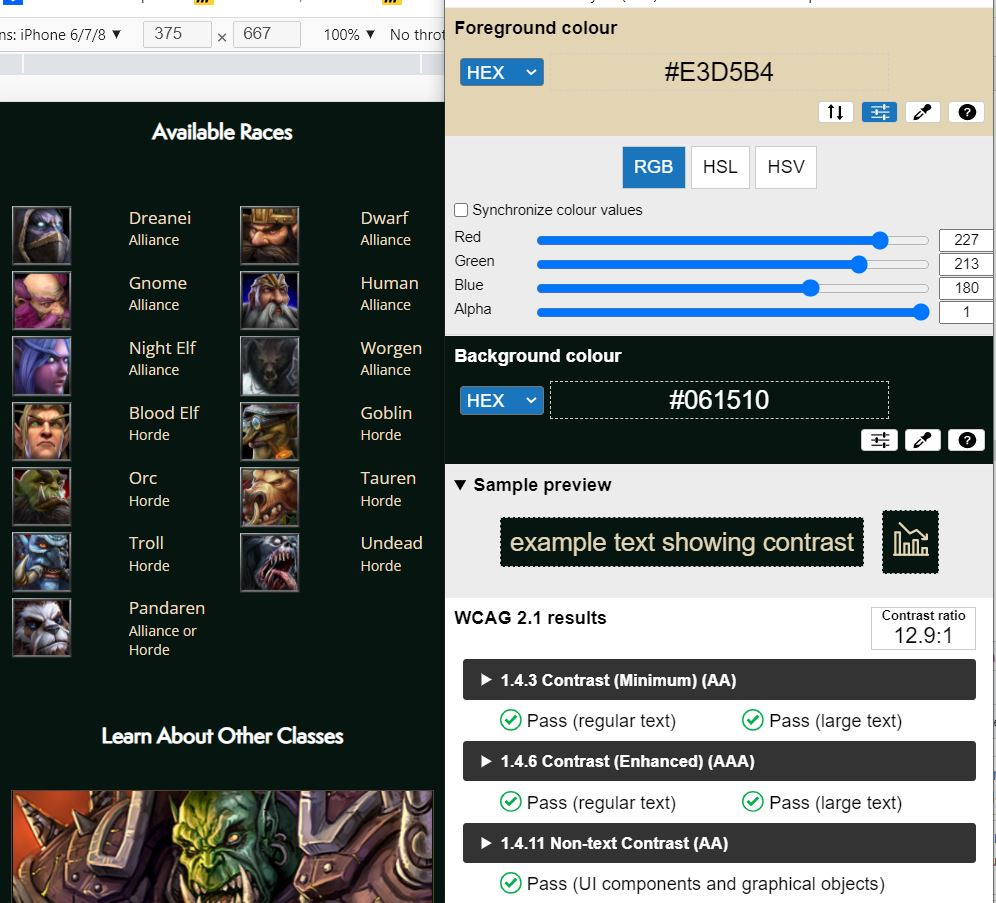
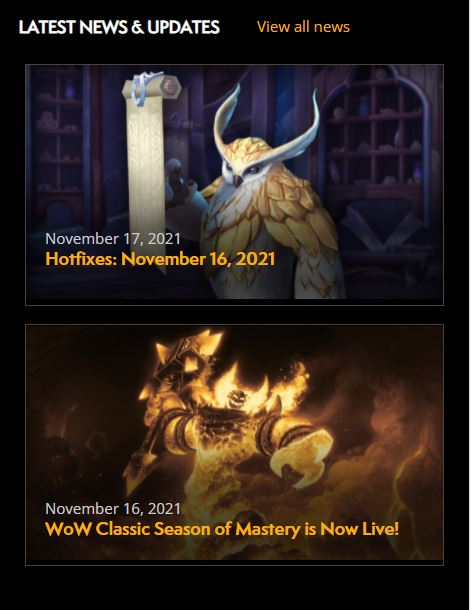

# Procesverslag
Markdown is een simpele manier om HTML te schrijven.  
Markdown cheat cheet: [Hulp bij het schrijven van Markdown](https://github.com/adam-p/markdown-here/wiki/Markdown-Cheatsheet).

Nb. De standaardstructuur en de spartaanse opmaak van de README.md zijn helemaal prima. Het gaat om de inhoud van je procesverslag. Besteedt de tijd voor pracht en praal aan je website.

Nb. Door *open* toe te voegen aan een *details* element kun je deze standaard open zetten. Fijn om dat steeds voor de relevante stuk(ken) te doen.

## Jij

uitwerken voor kick-off werkgroep

### Auteur:
Amber Mudde 

#### Je startniveau:
Blauwe piste

#### Je focus:
Surface plane
 

## Je website

uitwerken voor kick-off werkgroep

### Je opdracht:
https://worldofwarcraft.com/en-us/

#### Screenshot(s) van de eerste pagina (small screen): 
Homepage

#### Screenshot(s) van de tweede pagina (small screen):
Hunter class page

 

## Breakdownschets (week 1)

uitwerken na afloop 2e werkgroep

### de hele pagina: 

### dynamisch deel (bijv menu): 

## Voortgang 1 (week 2)

uitwerken voor 1e voortgang

### Stand van zaken
Ik kon mijn website van vorig schooljaar nog gebruiken voor deze herkansing, dus veel van de site had ik al. Ik had al alle html en een groot deel van de css. Sommige dingen in mijn code waren echter nog niet helemaal kloppend, zoals de headings (op de verkeerde plekken), 0 custom properties en ook was de website nog lang niet responsive genoeg. Teksten verschoven niet mee en een aantal plaatjes werden groter terwijl dat niet hoorde. Verder was het wel heel fijn om met deze site mogen/kunnen te beginnen. Ik hoefde me geen zorgen te maken om het plaatsen van de content. Ik kon me het hele blok bezig gaan houden met mijn code correcter schrijven.  

### Agenda voor meeting
samen met je groepje opstellen

| student 1      | student 2          | student 3    | student 4        |
| ---            | ---                | ---          | ---              |
| dit bespreken  | en dit             | en ik dit    | en dan ik dat    |
| en dat ook nog | dit als er tijd is | nog een punt | dit wil ik zeker |
| ...            | ...                | ...          | ...              |

Mijn vraag: Hoe maak ik mijn site responsive/hoe werken media queries? 
Vraag Laura: Hoe werkt het met elementen selecteren (doet het soms wel & soms niet)?

### Verslag van meeting
hier na afloop snel de uitkomsten van de meeting vastleggen

- Teveel ruimte aan de zijkanten kon ik oplossen door een standaard code toe te voegen aan de bovenkant van het css bestandje. 
- Ik hoef niet de volledige pagina van de site na te maken, maar ik kan ook delen gebruiken, omdat sommige blokken zich toch herhalen. 
- Ik moet nog custom properties toepassen (sowieso kleuren en eventueel andere dingen erin)
- Min-width gebruiken bij media queries
- Tot 560px responsive maken  (voor surface plane)
- Linkjes in alle menu opties
- Logo moet uit de nav en los in de header staan
- Site moet een H1 hebben voor de screenreader (deze kan ik onzichtbaar maken met class="visually-hidden")
- 2 buttons en 1 link in de header (dus buttons en a eromheen zetten)

## Voortgang 2 (week 3)

uitwerken voor 2e voortgang

### Stand van zaken
Bij het vorige voortgangsgesprek kreeg ik wat tips om mijn html netter en correcter te maken. Deze aanpassingen zorgden er natuurlijk wel voor dat dingen in mijn css niet meer goed gelinkt stonden. Ik was deze week dus voornamelijk bezig met het herstellen van mijn pagina. 

### Agenda voor meeting
samen met je groepje opstellen

| student 1      | student 2          | student 3    | student 4        |
| ---            | ---                | ---          | ---              |
| dit bespreken  | en dit             | en ik dit    | en dan ik dat    |
| en dat ook nog | dit als er tijd is | nog een punt | dit wil ik zeker |
| ...            | ...                | ...          | ...              |

Mijn vraag: Hoe positioneer ik de tekst op mijn 2 nieuws artikelen op een manier waarbij het mooi meeschaalt?
Vraag Donna: Heb ik genoeg alt labels voor een screenreader?
Vraag Mila: Hoe kan ik dit hartje animeren? 

### Verslag van meeting
hier na afloop snel de uitkomsten van de meeting vastleggen

- Op sommige plekken had ik een article met sections erin en op andere plekken had ik een section met articles erin. Dit moet consistent worden.
Dus alle parents moeten of articles of sections zijn. 
- De h2 en h3 op de homepage moet ik omdraaien. Hetgeen dat nu een h3 is, is eigenlijk belangrijker qua inhoud/kopje. Met css moet ik de tekst dan groter of kleiner maken.
- Ik heb nu nog pixels gebruikt om afstanden en groottes aan te geven. Dit moet ik veranderen naar em (ook in de header moet ik hierop letten bij de icons). 

## Toegankelijkheidstest (week 4)

uitwerken na test in 8e voortgang

### Bevindingen
Lijst met je bevindingen die in de test naar voren kwamen:

Tab werkte niet (opgelost door states mee te geven waardoor je als gebruikt kunt zien waar je bent op de pagina tijdens het tabben).

#### Images worden niet voorgelezen
Wanneer de screenreader over een afbeelding gaat, wordt deze niet voorgelezen, waardoor de gebruiker niet weet wat voor soort afbeelding hij voor zich heeft.

Dit kan opgelost worden door de images een 'alt' mee te geven.

#### Links
De screenreader noemt op dat het gaat om een link en leest de inhoud van de link voor waardoor het duidelijk is waar je geen gaat. 

#### States
Je weet niet helemaal precies wanneer je op een bepaald element zit en wanneer deze bijvoorbeeld actief is. 
Dit kan ik oplossen door in de css nog vormgeving aan alle states mee te geven. 

#### Kleurcontrast. 
Met de colour contrast analyzer heb ik elementen op mijn website geanalyseerd, maar het bleek dat alles genoeg contrast heeft. Dit deel is dus goed toegankelijk. 

## Voortgang 3 (week 4)

uitwerken voor 3e voortgang

### Stand van zaken

### Agenda voor meeting
samen met je groepje opstellen

| student 1      | student 2          | student 3    | student 4        |
| ---            | ---                | ---          | ---              |
| dit bespreken  | en dit             | en ik dit    | en dan ik dat    |
| en dat ook nog | dit als er tijd is | nog een punt | dit wil ik zeker |
| ...            | ...                | ...          | ...              |

-	1 animatie in javascript doet het, de rest niet (laura)

-	Object observer api werkt niet (idelene)

-	Hoe maak ik een tabel? (shanine)

-	Carrousel begint op helft van pagina (mila) gefixed door sjoerd

-	Mag hier een class? (donna)

-	Bauw lijntje onder plaatje moest weg (Sena Nur), gefixed met display block op image zetten 
 

### Verslag van meeting
hier na afloop snel de uitkomsten van de meeting vastleggen

- Ik moet opletten dat ik mijn code netjes en overzichtelijk houd. Veel stukken staan nu nog door elkaar of dubbel erin. 

## Eindgesprek (week 5)

uitwerken voor eindgesprek

### Stand van zaken

### Screenshot(s)

## Bronnenlijst

continu bijhouden terwijl je werkt

Nb. Wees specifiek ('css-tricks' als bron is bijv. niet specifiek genoeg).

1. bron 1
2. bron 2
3. ...

